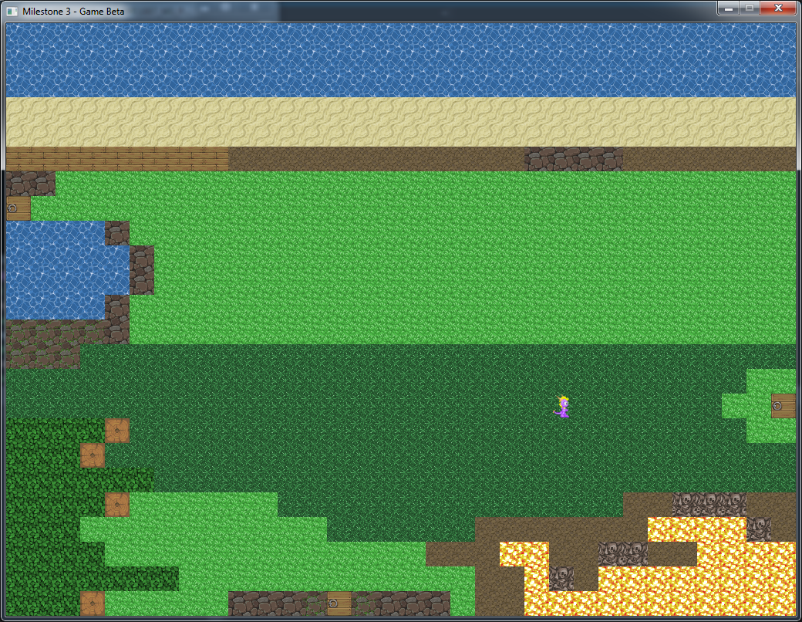
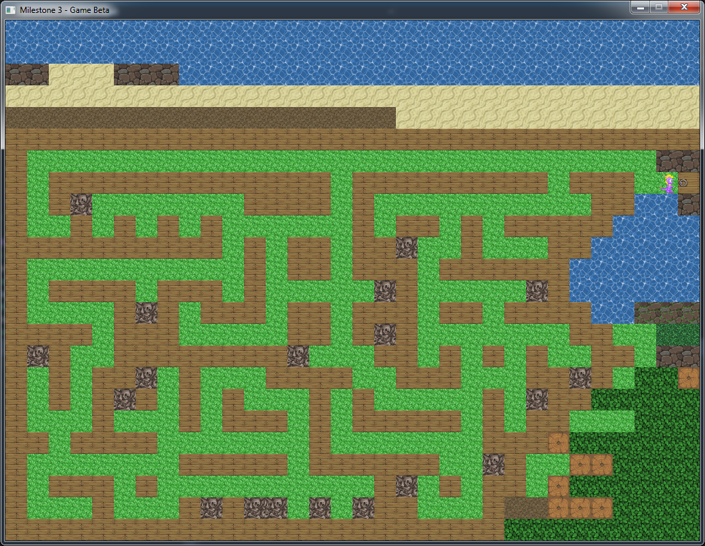
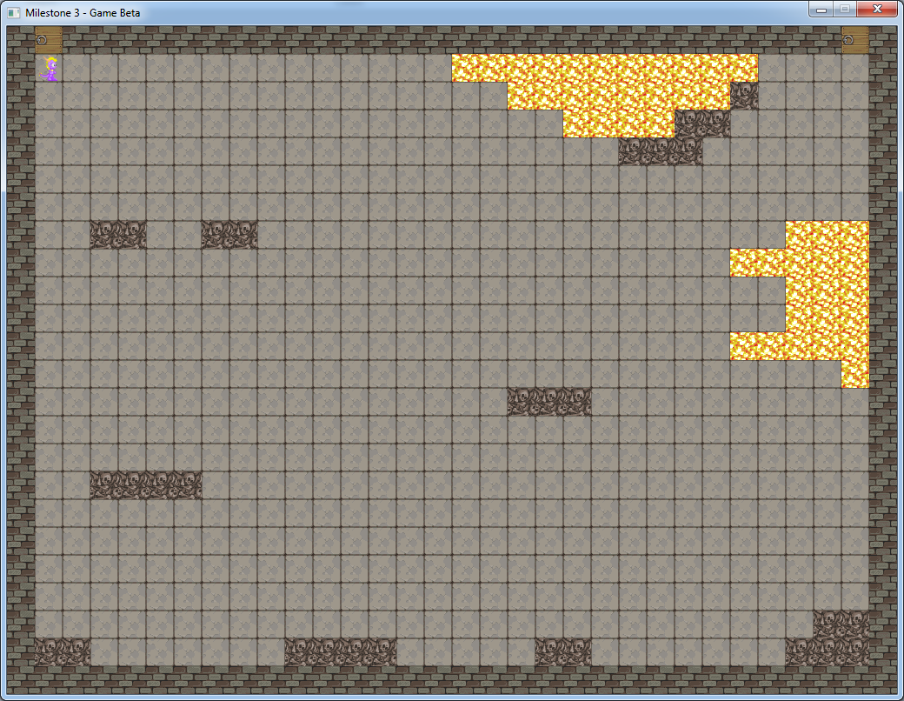
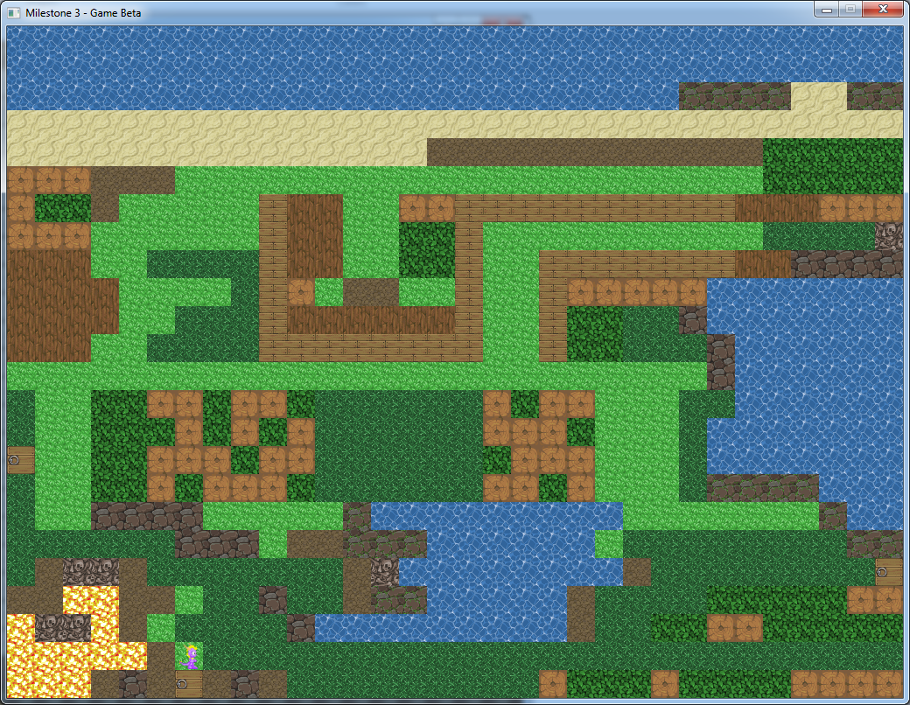
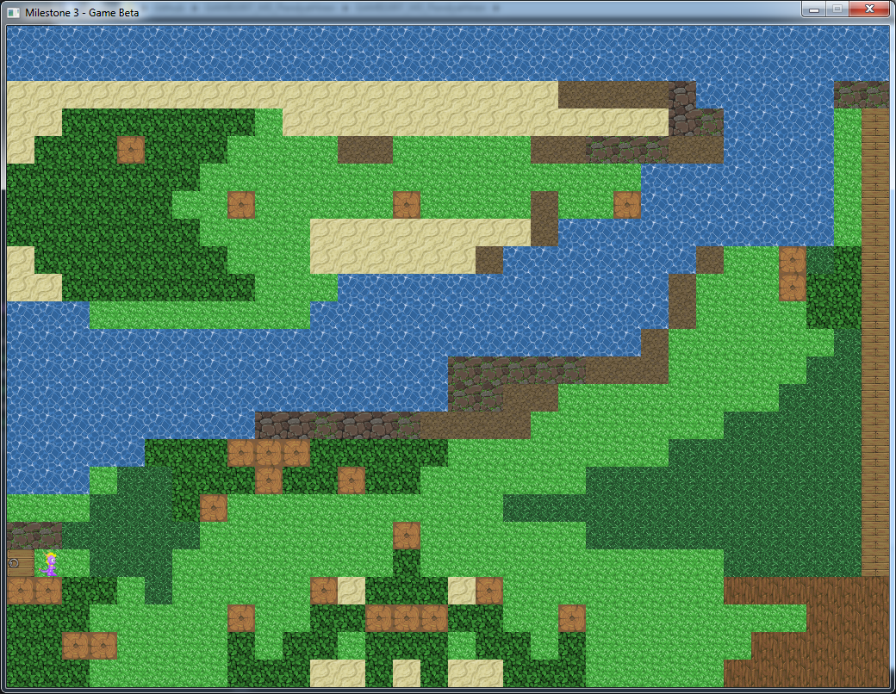
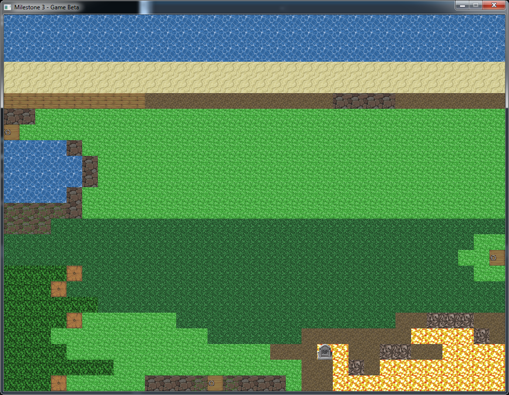

# PyroAdventures2D

### This 2D game, made using SDL, explores the fundamental aspects of SDL. The map segments were prepared in plaintext. The game reads the information from the text file and selects the textures accordingly. Player can control their character using 'W', 'A', 'S', and 'D' keys. This game was developed as a part of a milestone project of first semester.

# Libraries Utilized 
* SDL2 2.0.8
* SDL2_image 2.0.4

# Screenshots

### Map Level 1 - Initial Level

### Map Level 2

### Map Level 3

### Map Level 4

### Map Level 5

### Player Death

